# 紅包拿來 - 專案架構文檔

## 📋 目錄
- [專案概述](#專案概述)
- [技術棧](#技術棧)
- [專案結構樹](#專案結構樹)
- [系統架構圖](#系統架構圖)
- [用戶流程圖](#用戶流程圖)
- [資料結構](#資料結構)
- [組件架構](#組件架構)
- [API 流程](#api-流程)

---

## 專案概述

一個基於 Movement Network（Aptos 兼容）的去中心化紅包應用，使用 Privy 提供無縫的錢包體驗。

### 核心功能
- 🎁 創建紅包（隨機金額分配）
- 💰 領取紅包（密碼保護）
- 👛 Privy 嵌入式錢包管理
- 🔄 多錢包切換
- 📱 QR Code 分享

---

## 技術棧

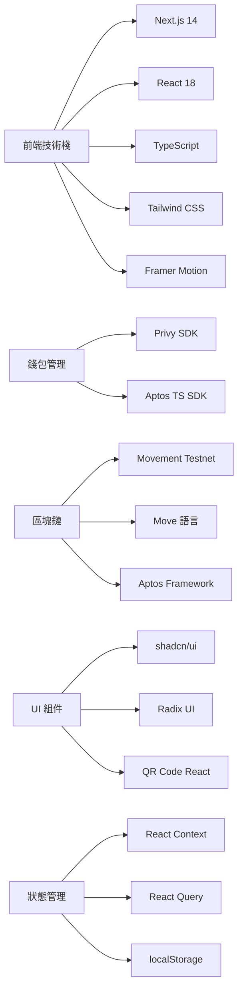
```mermaid
graph LR
    A[前端技術棧] --> B[Next.js 14]
    A --> C[React 18]
    A --> D[TypeScript]
    A --> E[Tailwind CSS]
    A --> F[Framer Motion]
    
    G[錢包管理] --> H[Privy SDK]
    G --> I[Aptos TS SDK]
    
    J[區塊鏈] --> K[Movement Testnet]
    J --> L[Move 語言]
    J --> M[Aptos Framework]
    
    N[UI 組件] --> O[shadcn/ui]
    N --> P[Radix UI]
    N --> Q[QR Code React]
    
    R[狀態管理] --> S[React Context]
    R --> T[React Query]
    R --> U[localStorage]
```

---

## 專案結構樹

```
fortunedrop/
├── 📁 contract/                    # Move 智能合約
│   ├── Move.toml                   # 合約配置
│   ├── sources/
│   │   └── red_packet.move         # 紅包合約主文件
│   └── build/                      # 編譯產物（已忽略）
│
├── 📁 src/                         # 前端源碼
│   ├── 📁 app/                     # Next.js App Router
│   │   ├── layout.tsx              # 根佈局（包含 Providers）
│   │   ├── page.tsx                # 首頁（創建紅包）
│   │   ├── my-red-packets/         # 我的紅包列表
│   │   │   └── page.tsx
│   │   ├── redpacket/[id]/         # 領取紅包頁面（動態路由）
│   │   │   └── page.tsx
│   │   └── wallet/                 # 錢包管理頁面
│   │       └── page.tsx
│   │
│   ├── 📁 components/              # React 組件
│   │   ├── MovementPrivyWalletProvider.tsx  # 錢包 Context Provider
│   │   ├── PrivyAuthProvider.tsx            # Privy 認證 Provider
│   │   ├── PrivyWalletButton.tsx            # 登入/創建錢包按鈕
│   │   ├── WalletSelector.tsx               # 多錢包選擇器
│   │   ├── Header.tsx                       # 頁面標頭
│   │   ├── RedPacket.tsx                    # 紅包創建表單
│   │   └── ui/                              # shadcn/ui 組件
│   │       ├── button.tsx
│   │       ├── dialog.tsx
│   │       ├── toast.tsx
│   │       └── ...
│   │
│   ├── 📁 entry-functions/         # 區塊鏈寫入操作
│   │   ├── createRedPacket.ts      # 創建紅包交易
│   │   └── claimRedPacket.ts       # 領取紅包交易
│   │
│   ├── 📁 view-functions/          # 區塊鏈讀取操作
│   │   ├── getRedPacketInfo.ts     # 查詢紅包資訊
│   │   └── getAccountBalance.ts    # 查詢帳戶餘額
│   │
│   ├── 📁 utils/                   # 工具函數
│   │   ├── aptosClient.ts          # Aptos 客戶端單例
│   │   └── helpers.ts              # 輔助函數
│   │
│   └── constants.ts                # 常量定義
│
├── 📁 scripts/                     # 部署腳本
│   └── move/
│       ├── compile.js              # 編譯合約
│       └── publish.js              # 發布合約
│
├── 📁 public/                      # 靜態資源
│   └── images/                     # 圖片素材
│
├── .env                            # 環境變數（已忽略）
├── .gitignore                      # Git 忽略規則
├── package.json                    # NPM 依賴
├── tailwind.config.js              # Tailwind 配置
└── tsconfig.json                   # TypeScript 配置
```

---

## 系統架構圖

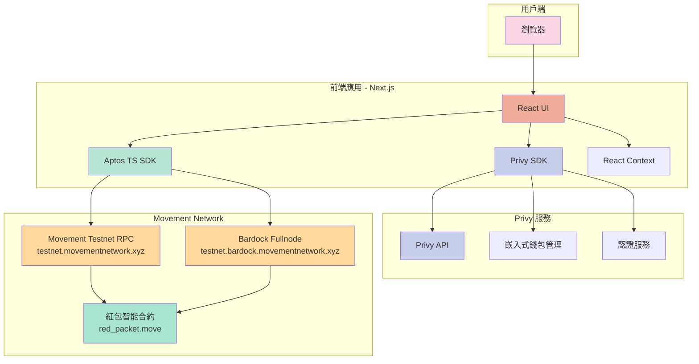
```mermaid
graph TB
    subgraph "用戶端"
        A[瀏覽器]
    end
    
    subgraph "前端應用 - Next.js"
        B[React UI]
        C[Privy SDK]
        D[Aptos TS SDK]
        E[React Context]
    end
    
    subgraph "Privy 服務"
        F[Privy API]
        G[嵌入式錢包管理]
        H[認證服務]
    end
    
    subgraph "Movement Network"
        I[Movement Testnet RPC<br/>testnet.movementnetwork.xyz]
        J[Bardock Fullnode<br/>testnet.bardock.movementnetwork.xyz]
        K[紅包智能合約<br/>red_packet.move]
    end
    
    A --> B
    B --> C
    B --> D
    B --> E
    C --> F
    C --> G
    C --> H
    D --> I
    D --> J
    I --> K
    J --> K
    
    style A fill:#f9d5e5
    style B fill:#eeac99
    style C fill:#c7ceea
    style D fill:#b8e6d5
    style F fill:#c7ceea
    style I fill:#ffd89b
    style J fill:#ffd89b
    style K fill:#a8e6cf
```

---

## 用戶流程圖

### 1. 創建紅包流程

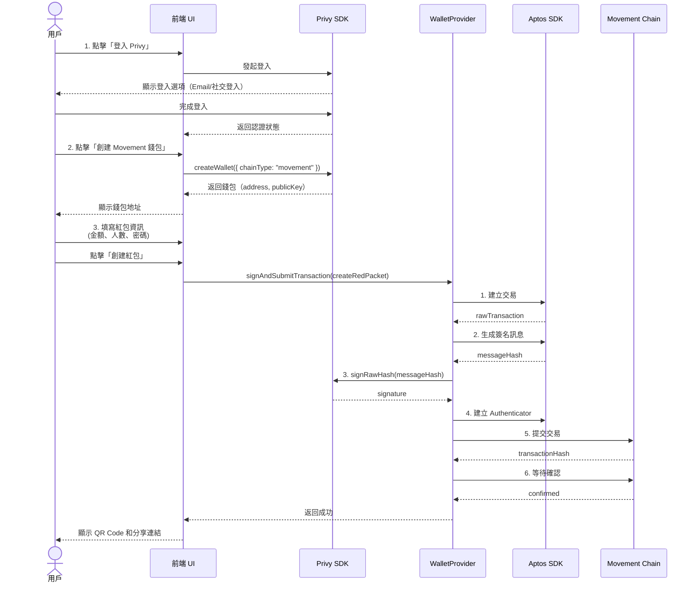
```mermaid
sequenceDiagram
    actor User as 用戶
    participant UI as 前端 UI
    participant Privy as Privy SDK
    participant Provider as WalletProvider
    participant SDK as Aptos SDK
    participant Chain as Movement Chain
    
    User->>UI: 1. 點擊「登入 Privy」
    UI->>Privy: 發起登入
    Privy-->>User: 顯示登入選項（Email/社交登入）
    User->>Privy: 完成登入
    Privy-->>UI: 返回認證狀態
    
    User->>UI: 2. 點擊「創建 Movement 錢包」
    UI->>Privy: createWallet({ chainType: "movement" })
    Privy-->>UI: 返回錢包（address, publicKey）
    UI-->>User: 顯示錢包地址
    
    User->>UI: 3. 填寫紅包資訊<br/>(金額、人數、密碼)
    User->>UI: 點擊「創建紅包」
    UI->>Provider: signAndSubmitTransaction(createRedPacket)
    
    Provider->>SDK: 1. 建立交易
    SDK-->>Provider: rawTransaction
    
    Provider->>SDK: 2. 生成簽名訊息
    SDK-->>Provider: messageHash
    
    Provider->>Privy: 3. signRawHash(messageHash)
    Privy-->>Provider: signature
    
    Provider->>SDK: 4. 建立 Authenticator
    Provider->>Chain: 5. 提交交易
    Chain-->>Provider: transactionHash
    
    Provider->>Chain: 6. 等待確認
    Chain-->>Provider: confirmed
    
    Provider-->>UI: 返回成功
    UI-->>User: 顯示 QR Code 和分享連結
```

### 2. 領取紅包流程

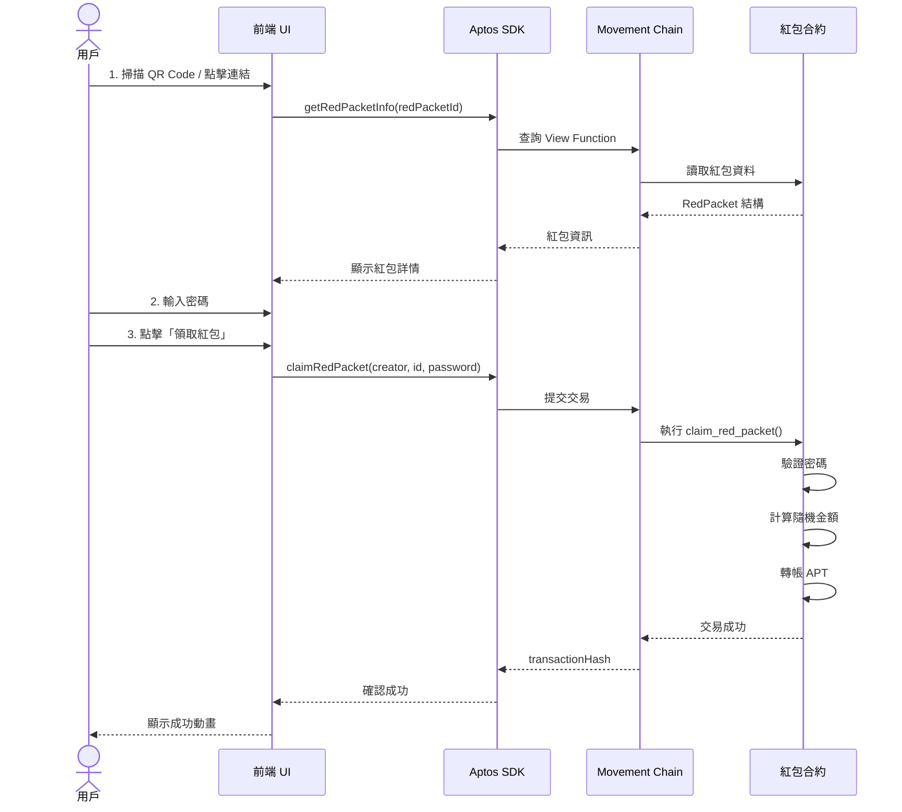
```mermaid
sequenceDiagram
    actor User as 用戶
    participant UI as 前端 UI
    participant SDK as Aptos SDK
    participant Chain as Movement Chain
    participant Contract as 紅包合約
    
    User->>UI: 1. 掃描 QR Code / 點擊連結
    UI->>SDK: getRedPacketInfo(redPacketId)
    SDK->>Chain: 查詢 View Function
    Chain->>Contract: 讀取紅包資料
    Contract-->>Chain: RedPacket 結構
    Chain-->>SDK: 紅包資訊
    SDK-->>UI: 顯示紅包詳情
    
    User->>UI: 2. 輸入密碼
    User->>UI: 3. 點擊「領取紅包」
    
    UI->>SDK: claimRedPacket(creator, id, password)
    SDK->>Chain: 提交交易
    Chain->>Contract: 執行 claim_red_packet()
    
    Contract->>Contract: 驗證密碼
    Contract->>Contract: 計算隨機金額
    Contract->>Contract: 轉帳 APT
    
    Contract-->>Chain: 交易成功
    Chain-->>SDK: transactionHash
    SDK-->>UI: 確認成功
    UI-->>User: 顯示成功動畫
```

---

## 資料結構

### Move 合約資料結構

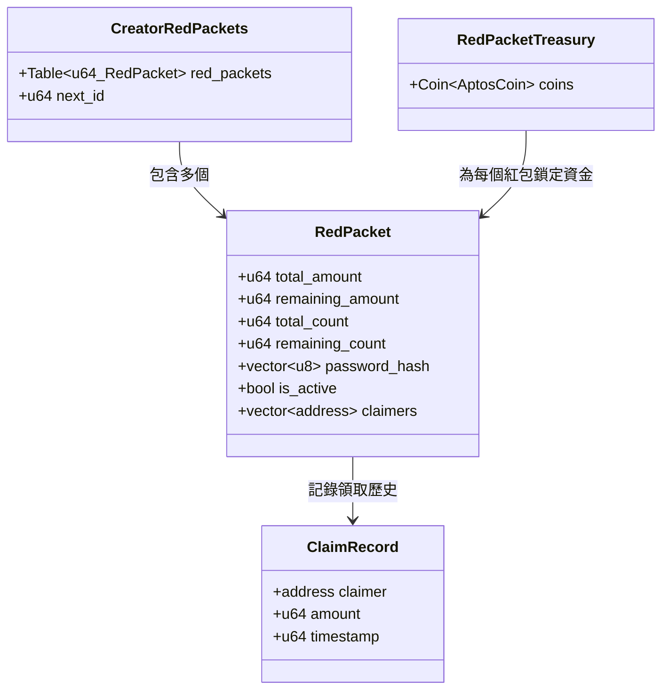
```mermaid
classDiagram
    class RedPacket {
        +u64 total_amount
        +u64 remaining_amount
        +u64 total_count
        +u64 remaining_count
        +vector~u8~ password_hash
        +bool is_active
        +vector~address~ claimers
    }
    
    class CreatorRedPackets {
        +Table~u64_RedPacket~ red_packets
        +u64 next_id
    }
    
    class RedPacketTreasury {
        +Coin~AptosCoin~ coins
    }
    
    class ClaimRecord {
        +address claimer
        +u64 amount
        +u64 timestamp
    }
    
    CreatorRedPackets --> RedPacket : 包含多個
    RedPacketTreasury --> RedPacket : 為每個紅包鎖定資金
    RedPacket --> ClaimRecord : 記錄領取歷史
```

### 前端狀態結構

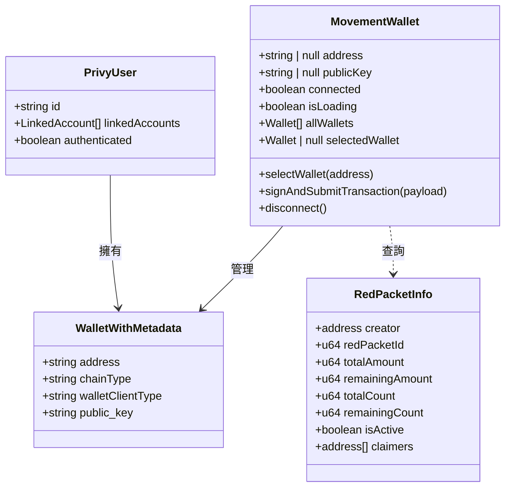
```mermaid
classDiagram
    class MovementWallet {
        +string | null address
        +string | null publicKey
        +boolean connected
        +boolean isLoading
        +Wallet[] allWallets
        +Wallet | null selectedWallet
        +selectWallet(address)
        +signAndSubmitTransaction(payload)
        +disconnect()
    }
    
    class PrivyUser {
        +string id
        +LinkedAccount[] linkedAccounts
        +boolean authenticated
    }
    
    class WalletWithMetadata {
        +string address
        +string chainType
        +string walletClientType
        +string public_key
    }
    
    class RedPacketInfo {
        +address creator
        +u64 redPacketId
        +u64 totalAmount
        +u64 remainingAmount
        +u64 totalCount
        +u64 remainingCount
        +boolean isActive
        +address[] claimers
    }
    
    MovementWallet --> WalletWithMetadata : 管理
    PrivyUser --> WalletWithMetadata : 擁有
    MovementWallet ..> RedPacketInfo : 查詢
```

---

## 組件架構

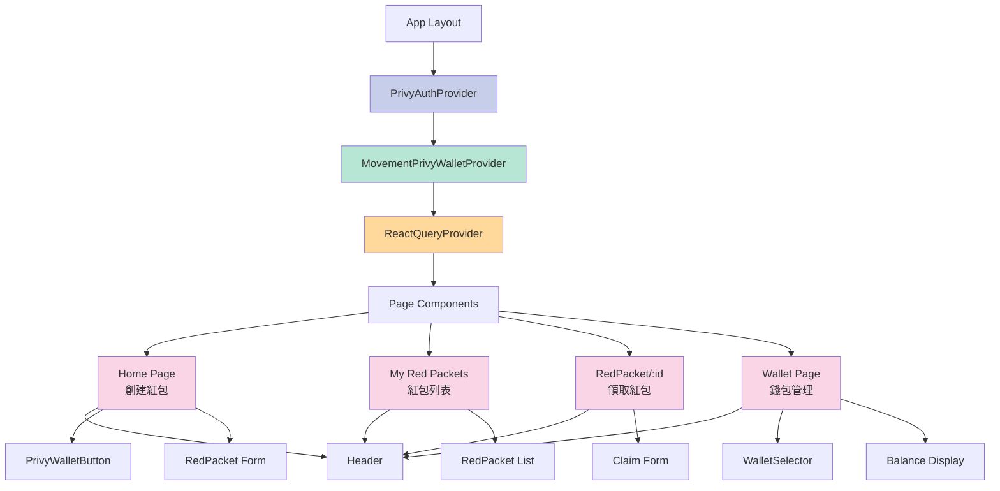
```mermaid
graph TD
    A[App Layout] --> B[PrivyAuthProvider]
    B --> C[MovementPrivyWalletProvider]
    C --> D[ReactQueryProvider]
    D --> E[Page Components]
    
    E --> F[Home Page<br/>創建紅包]
    E --> G[My Red Packets<br/>紅包列表]
    E --> H[RedPacket/:id<br/>領取紅包]
    E --> I[Wallet Page<br/>錢包管理]
    
    F --> J[Header]
    F --> K[PrivyWalletButton]
    F --> L[RedPacket Form]
    
    I --> J
    I --> M[WalletSelector]
    I --> N[Balance Display]
    
    H --> J
    H --> O[Claim Form]
    
    G --> J
    G --> P[RedPacket List]
    
    style B fill:#c7ceea
    style C fill:#b8e6d5
    style D fill:#ffd89b
    style F fill:#f9d5e5
    style G fill:#f9d5e5
    style H fill:#f9d5e5
    style I fill:#f9d5e5
```

### 組件依賴關係

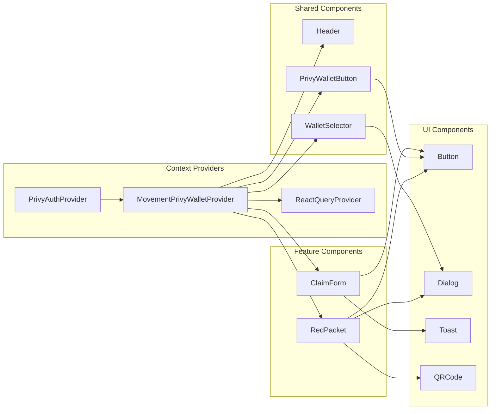
```mermaid
graph LR
    subgraph "Context Providers"
        A[PrivyAuthProvider]
        B[MovementPrivyWalletProvider]
        C[ReactQueryProvider]
    end
    
    subgraph "Shared Components"
        D[Header]
        E[PrivyWalletButton]
        F[WalletSelector]
    end
    
    subgraph "Feature Components"
        G[RedPacket]
        H[ClaimForm]
    end
    
    subgraph "UI Components"
        I[Button]
        J[Dialog]
        K[Toast]
        L[QRCode]
    end
    
    A --> B
    B --> C
    B --> D
    B --> E
    B --> F
    B --> G
    B --> H
    
    G --> I
    G --> J
    G --> L
    E --> I
    F --> J
    H --> I
    H --> K
```

---

## API 流程

### 錢包簽名交易流程

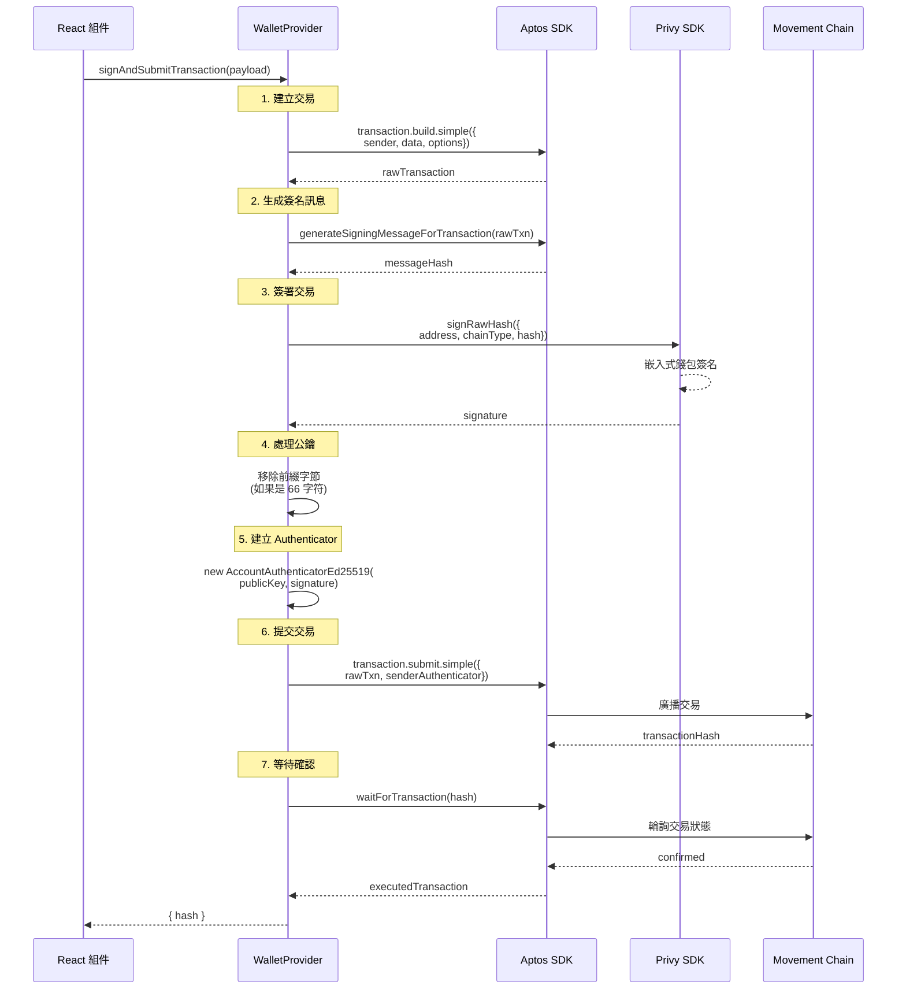
```mermaid
sequenceDiagram
    participant Comp as React 組件
    participant Provider as WalletProvider
    participant Aptos as Aptos SDK
    participant Privy as Privy SDK
    participant Chain as Movement Chain
    
    Comp->>Provider: signAndSubmitTransaction(payload)
    
    Note over Provider: 1. 建立交易
    Provider->>Aptos: transaction.build.simple({<br/>sender, data, options})
    Aptos-->>Provider: rawTransaction
    
    Note over Provider: 2. 生成簽名訊息
    Provider->>Aptos: generateSigningMessageForTransaction(rawTxn)
    Aptos-->>Provider: messageHash
    
    Note over Provider: 3. 簽署交易
    Provider->>Privy: signRawHash({<br/>address, chainType, hash})
    Privy-->>Privy: 嵌入式錢包簽名
    Privy-->>Provider: signature
    
    Note over Provider: 4. 處理公鑰
    Provider->>Provider: 移除前綴字節<br/>(如果是 66 字符)
    
    Note over Provider: 5. 建立 Authenticator
    Provider->>Provider: new AccountAuthenticatorEd25519(<br/>publicKey, signature)
    
    Note over Provider: 6. 提交交易
    Provider->>Aptos: transaction.submit.simple({<br/>rawTxn, senderAuthenticator})
    Aptos->>Chain: 廣播交易
    Chain-->>Aptos: transactionHash
    
    Note over Provider: 7. 等待確認
    Provider->>Aptos: waitForTransaction(hash)
    Aptos->>Chain: 輪詢交易狀態
    Chain-->>Aptos: confirmed
    Aptos-->>Provider: executedTransaction
    
    Provider-->>Comp: { hash }
```

### 錢包管理流程

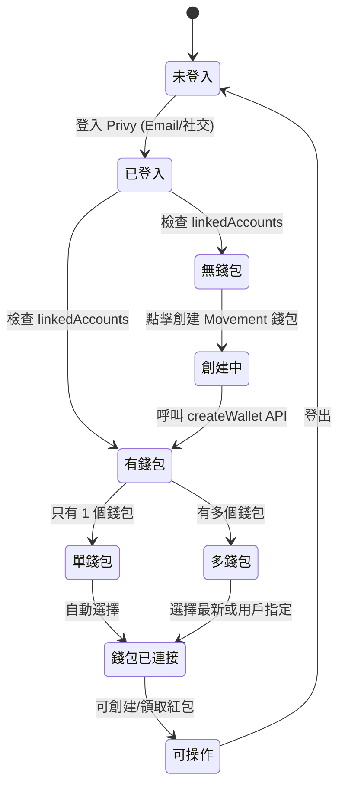
```mermaid
stateDiagram-v2
    [*] --> 未登入
    
    未登入 --> 已登入 : 登入 Privy (Email/社交)
    
    已登入 --> 無錢包 : 檢查 linkedAccounts
    已登入 --> 有錢包 : 檢查 linkedAccounts
    
    無錢包 --> 創建中 : 點擊創建 Movement 錢包
    創建中 --> 有錢包 : 呼叫 createWallet API
    
    有錢包 --> 單錢包 : 只有 1 個錢包
    有錢包 --> 多錢包 : 有多個錢包
    
    單錢包 --> 錢包已連接 : 自動選擇
    多錢包 --> 錢包已連接 : 選擇最新或用戶指定
    
    錢包已連接 --> 可操作 : 可創建/領取紅包
    
    可操作 --> 未登入 : 登出
```

---

## 資料結構詳解

### 1. Move 合約資料結構

#### RedPacket 結構
```move
struct RedPacket has store {
    total_amount: u64,        // 總金額（Octa）
    remaining_amount: u64,    // 剩餘金額
    total_count: u64,         // 總份數
    remaining_count: u64,     // 剩餘份數
    password_hash: vector<u8>, // 密碼哈希（SHA3-256）
    is_active: bool,          // 是否啟用
    claimers: vector<address> // 已領取者列表
}
```

#### CreatorRedPackets 結構
```move
struct CreatorRedPackets has key {
    red_packets: Table<u64, RedPacket>, // ID -> RedPacket 映射
    next_id: u64                        // 下一個 ID
}
```

#### RedPacketTreasury 結構
```move
struct RedPacketTreasury has key {
    coins: Coin<AptosCoin> // 鎖定的 APT 幣
}
```

### 2. 前端介面定義

```typescript
// 錢包上下文
interface MovementWallet {
  address: string | null;           // 當前選中的錢包地址
  publicKey: string | null;         // 公鑰
  connected: boolean;               // 連接狀態
  isLoading: boolean;               // 載入狀態
  allWallets: Wallet[];            // 所有可用錢包
  selectedWallet: Wallet | null;    // 當前選中的錢包物件
  selectWallet: (address: string) => void;
  signAndSubmitTransaction: (payload: any) => Promise<{ hash: string }>;
  disconnect: () => void;
}

// 紅包資訊
interface RedPacketInfo {
  creator: string;                  // 創建者地址
  redPacketId: number;             // 紅包 ID
  totalAmount: number;             // 總金額（APT）
  remainingAmount: number;         // 剩餘金額
  totalCount: number;              // 總份數
  remainingCount: number;          // 剩餘份數
  isActive: boolean;               // 是否啟用
  claimers: string[];              // 已領取者列表
}

// 交易 Payload
interface TransactionPayload {
  data: {
    function: string;              // 合約函數
    typeArguments?: string[];      // 類型參數
    functionArguments: any[];      // 函數參數
  };
  options?: {
    maxGasAmount?: number;
    gasUnitPrice?: number;
  };
}
```

---

## 資料流向圖

### 創建紅包資料流

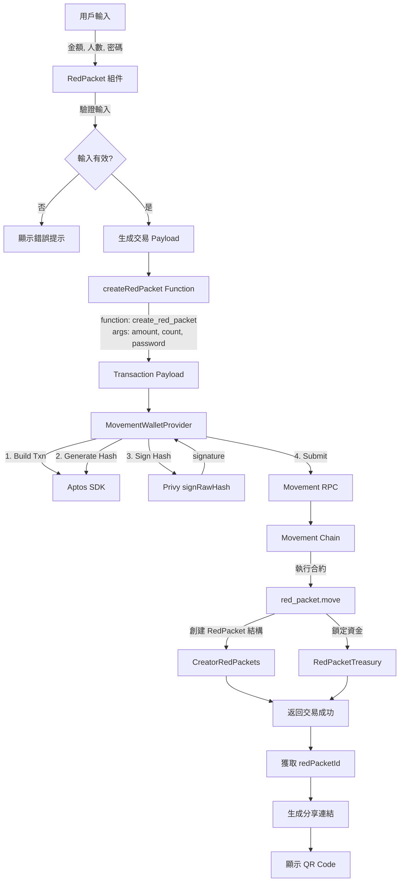
```mermaid
flowchart TD
    A[用戶輸入] -->|金額, 人數, 密碼| B[RedPacket 組件]
    B -->|驗證輸入| C{輸入有效?}
    C -->|否| D[顯示錯誤提示]
    C -->|是| E[生成交易 Payload]
    
    E --> F[createRedPacket Function]
    F -->|function: create_red_packet<br/>args: amount, count, password| G[Transaction Payload]
    
    G --> H[MovementWalletProvider]
    H -->|1. Build Txn| I[Aptos SDK]
    H -->|2. Generate Hash| I
    H -->|3. Sign Hash| J[Privy signRawHash]
    J -->|signature| H
    H -->|4. Submit| K[Movement RPC]
    
    K --> L[Movement Chain]
    L -->|執行合約| M[red_packet.move]
    M -->|創建 RedPacket 結構| N[CreatorRedPackets]
    M -->|鎖定資金| O[RedPacketTreasury]
    
    N --> P[返回交易成功]
    O --> P
    P --> Q[獲取 redPacketId]
    Q --> R[生成分享連結]
    R --> S[顯示 QR Code]
```

### 領取紅包資料流

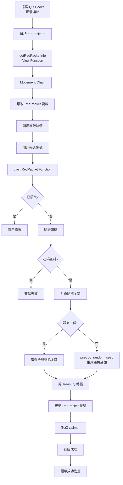
```mermaid
flowchart TD
    A[掃描 QR Code/<br/>點擊連結] --> B[解析 redPacketId]
    B --> C[getRedPacketInfo<br/>View Function]
    C --> D[Movement Chain]
    D --> E[讀取 RedPacket 資料]
    E --> F[顯示紅包詳情]
    
    F --> G[用戶輸入密碼]
    G --> H[claimRedPacket Function]
    H --> I{已領取?}
    I -->|是| J[顯示錯誤]
    I -->|否| K[驗證密碼]
    
    K --> L{密碼正確?}
    L -->|否| M[交易失敗]
    L -->|是| N[計算隨機金額]
    
    N --> O{最後一份?}
    O -->|是| P[獲得全部剩餘金額]
    O -->|否| Q[pseudo_random_seed<br/>生成隨機金額]
    
    P --> R[從 Treasury 轉帳]
    Q --> R
    R --> S[更新 RedPacket 狀態]
    S --> T[記錄 claimer]
    T --> U[返回成功]
    U --> V[顯示成功動畫]
```

---

## 核心技術實現

### 1. Privy 嵌入式錢包整合

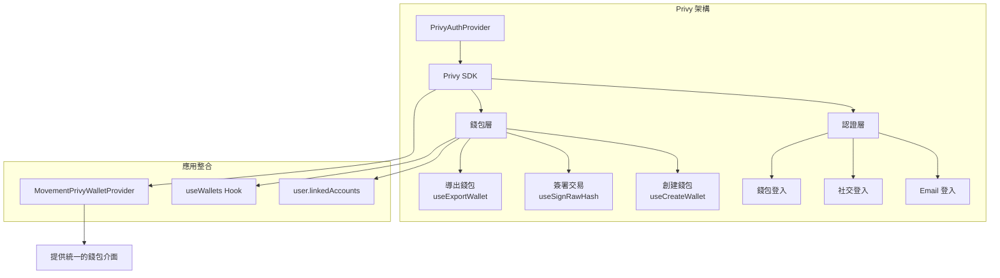
```mermaid
graph TB
    subgraph "Privy 架構"
        A[PrivyAuthProvider] --> B[Privy SDK]
        B --> C[認證層]
        B --> D[錢包層]
        
        C --> E[Email 登入]
        C --> F[社交登入]
        C --> G[錢包登入]
        
        D --> H[創建錢包<br/>useCreateWallet]
        D --> I[簽署交易<br/>useSignRawHash]
        D --> J[導出錢包<br/>useExportWallet]
    end
    
    subgraph "應用整合"
        K[MovementPrivyWalletProvider]
        L[user.linkedAccounts]
        M[useWallets Hook]
    end
    
    B --> K
    D --> L
    D --> M
    K --> N[提供統一的錢包介面]
```

### 2. Movement Network 整合

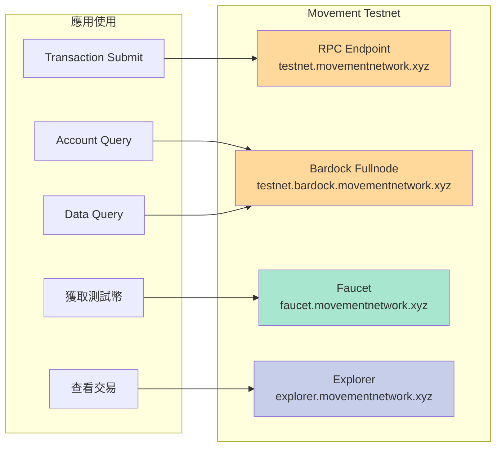
```mermaid
graph LR
    subgraph "Movement Testnet"
        A[RPC Endpoint<br/>testnet.movementnetwork.xyz]
        B[Bardock Fullnode<br/>testnet.bardock.movementnetwork.xyz]
        C[Faucet<br/>faucet.movementnetwork.xyz]
        D[Explorer<br/>explorer.movementnetwork.xyz]
    end
    
    subgraph "應用使用"
        E[Transaction Submit] --> A
        F[Account Query] --> B
        G[Data Query] --> B
        H[獲取測試幣] --> C
        I[查看交易] --> D
    end
    
    style A fill:#ffd89b
    style B fill:#ffd89b
    style C fill:#a8e6cf
    style D fill:#c7ceea
```

### 3. 隨機數生成機制

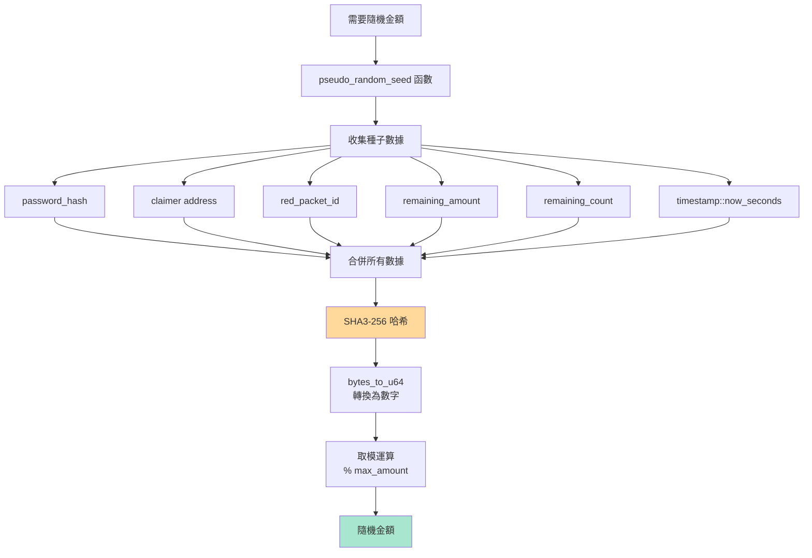
```mermaid
flowchart TD
    A[需要隨機金額] --> B[pseudo_random_seed 函數]
    
    B --> C[收集種子數據]
    C --> D[password_hash]
    C --> E[claimer address]
    C --> F[red_packet_id]
    C --> G[remaining_amount]
    C --> H[remaining_count]
    C --> I[timestamp::now_seconds]
    
    D --> J[合併所有數據]
    E --> J
    F --> J
    G --> J
    H --> J
    I --> J
    
    J --> K[SHA3-256 哈希]
    K --> L[bytes_to_u64<br/>轉換為數字]
    L --> M[取模運算<br/>% max_amount]
    M --> N[隨機金額]
    
    style K fill:#ffd89b
    style N fill:#a8e6cf
```

---

## 關鍵流程詳解

### 錢包狀態管理流程


```mermaid
stateDiagram-v2
    direction LR
    
    [*] --> CheckAuth : 頁面載入
    
    CheckAuth --> Loading : !ready
    CheckAuth --> NotAuth : !authenticated
    CheckAuth --> CheckWallets : authenticated
    
    Loading --> CheckAuth : ready
    
    NotAuth --> Login : 用戶點擊登入
    Login --> CheckWallets : 登入成功
    
    CheckWallets --> NoWallet : linkedAccounts 無 Aptos 錢包
    CheckWallets --> HasWallets : linkedAccounts 有 Aptos 錢包
    
    NoWallet --> Creating : 點擊創建 Movement 錢包
    Creating --> Reloading : createWallet 成功
    Reloading --> HasWallets : 頁面重新載入
    
    HasWallets --> SelectLatest : 無選擇記錄
    HasWallets --> SelectStored : localStorage 有記錄
    
    SelectLatest --> Connected : 選擇最新錢包
    SelectStored --> Connected : 恢復上次選擇
    
    Connected --> [*] : 錢包已連接，可操作
```

### 交易簽名詳細流程

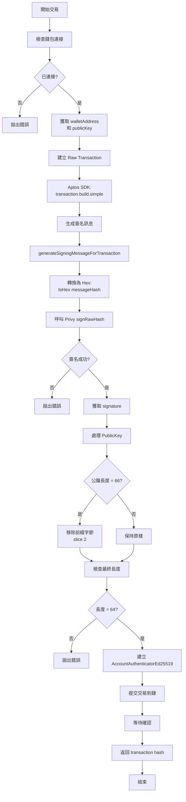
```mermaid
flowchart TD
    A[開始交易] --> B[檢查錢包連接]
    B --> C{已連接?}
    C -->|否| D[拋出錯誤]
    C -->|是| E[獲取 walletAddress<br/>和 publicKey]
    
    E --> F[建立 Raw Transaction]
    F --> G[Aptos SDK:<br/>transaction.build.simple]
    G --> H[生成簽名訊息]
    H --> I[generateSigningMessageForTransaction]
    I --> J[轉換為 Hex:<br/>toHex messageHash]
    
    J --> K[呼叫 Privy signRawHash]
    K --> L{簽名成功?}
    L -->|否| M[拋出錯誤]
    L -->|是| N[獲取 signature]
    
    N --> O[處理 PublicKey]
    O --> P{公鑰長度 = 66?}
    P -->|是| Q[移除前綴字節<br/>slice 2]
    P -->|否| R[保持原樣]
    
    Q --> S[檢查最終長度]
    R --> S
    S --> T{長度 = 64?}
    T -->|否| U[拋出錯誤]
    T -->|是| V[建立 AccountAuthenticatorEd25519]
    
    V --> W[提交交易到鏈]
    W --> X[等待確認]
    X --> Y[返回 transaction hash]
    Y --> Z[結束]
```

---

## Move 合約函數結構

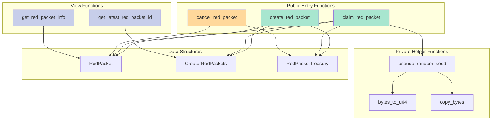
```mermaid
graph TD
    subgraph "Public Entry Functions"
        A[create_red_packet]
        B[claim_red_packet]
        C[cancel_red_packet]
    end
    
    subgraph "View Functions"
        D[get_red_packet_info]
        E[get_latest_red_packet_id]
    end
    
    subgraph "Private Helper Functions"
        F[pseudo_random_seed]
        G[bytes_to_u64]
        H[copy_bytes]
    end
    
    subgraph "Data Structures"
        I[RedPacket]
        J[CreatorRedPackets]
        K[RedPacketTreasury]
    end
    
    A --> I
    A --> J
    A --> K
    B --> F
    B --> I
    B --> J
    B --> K
    C --> I
    C --> K
    
    D --> I
    E --> J
    
    F --> G
    F --> H
    
    style A fill:#a8e6cf
    style B fill:#a8e6cf
    style C fill:#ffd89b
    style D fill:#c7ceea
    style E fill:#c7ceea
```

---

## 環境變數配置

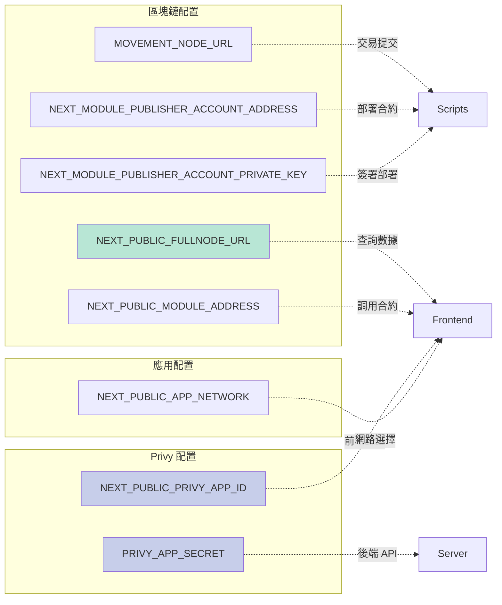
```mermaid
graph LR
    subgraph "區塊鏈配置"
        A[MOVEMENT_NODE_URL]
        B[NEXT_PUBLIC_FULLNODE_URL]
        C[NEXT_MODULE_PUBLISHER_ACCOUNT_ADDRESS]
        D[NEXT_MODULE_PUBLISHER_ACCOUNT_PRIVATE_KEY]
        E[NEXT_PUBLIC_MODULE_ADDRESS]
    end
    
    subgraph "Privy 配置"
        F[NEXT_PUBLIC_PRIVY_APP_ID]
        G[PRIVY_APP_SECRET]
    end
    
    subgraph "應用配置"
        H[NEXT_PUBLIC_APP_NETWORK]
    end
    
    A -.->|交易提交| I[Scripts]
    B -.->|查詢數據| J[Frontend]
    C -.->|部署合約| I
    D -.->|簽署部署| I
    E -.->|調用合約| J
    
    F -.->|前端認證| J
    G -.->|後端 API| K[Server]
    
    H -.->|網路選擇| J
    
    style F fill:#c7ceea
    style G fill:#c7ceea
    style B fill:#b8e6d5
```

---

## 頁面路由結構

```mermaid
graph TD
    A[/] --> B[首頁<br/>創建紅包]
    A --> C[/my-red-packets<br/>我的紅包列表]
    A --> D[/redpacket/:id<br/>領取紅包]
    A --> E[/wallet<br/>錢包管理]
    
    B --> F[顯示 PrivyWalletButton]
    B --> G[顯示 RedPacket 表單]
    
    C --> H[查詢用戶創建的紅包]
    C --> I[顯示紅包卡片列表]
    
    D --> J[解析 URL 參數 id]
    D --> K[查詢紅包資訊]
    D --> L[顯示領取表單]
    
    E --> M[顯示錢包地址]
    E --> N[顯示餘額]
    E --> O[WalletSelector<br/>多錢包切換]
    E --> P[登出功能]
    
    style B fill:#f9d5e5
    style C fill:#f9d5e5
    style D fill:#f9d5e5
    style E fill:#f9d5e5
```

---

## 性能優化策略

```mermaid
mindmap
  root((性能優化))
    React 優化
      useMemo
        緩存 uniqueWallets
        緩存 currentWallet
        緩存 Context value
      useCallback
        緩存回調函數
        避免子組件重新渲染
      清理函數
        防止內存洩漏
        isMounted 標誌
    
    SDK 優化
      單例模式
        Aptos Client 只創建一次
        全局共享實例
      批次操作
        合併多個查詢
    
    代碼優化
      移除 console.log
        生產環境關閉
      Tree Shaking
        移除未使用代碼
      懶加載
        動態 import
    
    網路優化
      正確的 RPC 選擇
        查詢用 Bardock
        交易用 Testnet
      錯誤重試
        指數退避
```

---

## 安全機制

```mermaid
graph TB
    subgraph "前端安全"
        A[Privy 認證]
        B[嵌入式錢包加密]
        C[本地存儲加密]
    end
    
    subgraph "合約安全"
        D[密碼哈希驗證]
        E[重複領取檢查]
        F[權限控制]
        G[資金鎖定機制]
    end
    
    subgraph "網路安全"
        H[HTTPS 通信]
        I[交易簽名驗證]
        J[鏈上驗證]
    end
    
    A --> D
    B --> I
    D --> E
    E --> F
    F --> G
    I --> J
    
    style A fill:#c7ceea
    style D fill:#a8e6cf
    style I fill:#ffd89b
```

---

## 部署流程

```mermaid
flowchart LR
    A[開發階段] --> B[編譯合約<br/>npm run move:compile]
    B --> C[部署合約<br/>npm run move:publish]
    C --> D[獲取合約地址]
    D --> E[更新 .env<br/>MODULE_ADDRESS]
    E --> F[前端開發<br/>npm run dev]
    F --> G[測試功能]
    G --> H{測試通過?}
    H -->|否| F
    H -->|是| I[構建前端<br/>npm run build]
    I --> J[部署到 Vercel]
    
    style C fill:#a8e6cf
    style I fill:#ffd89b
    style J fill:#c7ceea
```

---

## 錯誤處理流程

```mermaid
flowchart TD
    A[用戶操作] --> B{操作類型}
    
    B -->|創建紅包| C[檢查錢包連接]
    B -->|領取紅包| D[檢查錢包連接]
    
    C --> E{已連接?}
    E -->|否| F[提示登入]
    E -->|是| G[檢查餘額]
    
    G --> H{餘額足夠?}
    H -->|否| I[顯示錯誤<br/>餘額不足]
    H -->|是| J[簽署交易]
    
    J --> K{簽署成功?}
    K -->|否| L[顯示錯誤<br/>用戶拒絕]
    K -->|是| M[提交交易]
    
    M --> N{交易成功?}
    N -->|否| O[顯示錯誤<br/>交易失敗]
    N -->|是| P[顯示成功]
    
    D --> Q{已連接?}
    Q -->|否| F
    Q -->|是| R[檢查紅包狀態]
    
    R --> S{紅包有效?}
    S -->|否| T[顯示錯誤<br/>紅包已搶完/無效]
    S -->|是| U[檢查是否已領取]
    
    U --> V{已領取?}
    V -->|是| W[顯示錯誤<br/>已領取過]
    V -->|否| X[輸入密碼]
    
    X --> Y[驗證密碼]
    Y --> Z{密碼正確?}
    Z -->|否| AA[顯示錯誤<br/>密碼錯誤]
    Z -->|是| J
    
    style P fill:#a8e6cf
    style I fill:#ffb6b9
    style L fill:#ffb6b9
    style O fill:#ffb6b9
    style T fill:#ffb6b9
    style W fill:#ffb6b9
    style AA fill:#ffb6b9
```

---

## 總結

### 專案特色

1. **無縫的錢包體驗**
   - ✅ 使用 Privy 嵌入式錢包
   - ✅ 用戶無需管理私鑰
   - ✅ 支援多種登入方式
   - ✅ 多錢包管理

2. **完整的紅包功能**
   - ✅ 隨機金額分配
   - ✅ 密碼保護
   - ✅ 防止重複領取
   - ✅ QR Code 分享

3. **優化的性能**
   - ✅ React hooks 優化（useMemo, useCallback）
   - ✅ SDK 單例模式
   - ✅ 條件式 console.log
   - ✅ 內存洩漏防護

4. **技術正確性**
   - ✅ TypeScript 類型安全
   - ✅ 正確的 Move 合約實現
   - ✅ 可靠的交易簽名流程
   - ✅ 完善的錯誤處理

### 技術亮點

| 技術 | 用途 | 優勢 |
|------|------|------|
| Privy Embedded Wallets | 錢包管理 | 無需私鑰管理，UX 流暢 |
| Movement Network | 區塊鏈層 | Aptos 兼容，高性能 |
| Move 語言 | 智能合約 | 資源安全，形式化驗證 |
| Next.js 14 | 前端框架 | SSR, 路由優化 |
| TypeScript | 類型系統 | 編譯時錯誤檢查 |
| React Query | 數據獲取 | 自動緩存，重試機制 |


